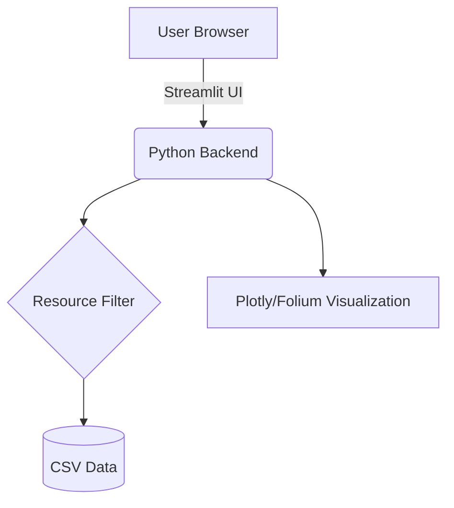

# Smart Emergency Resource Locator 🚑

[](https://www.gnu.org/licenses/agpl-3.0)
[](https://gitlab.com)
[]()

**OUR DEPLOYED APP LINK:** [Smart Emergency Resource Locator]https://smart-emergency-resource-locator-hlfeste2xaj4ycurgwdjry.streamlit.app/

## 📖 Project Overview

Smart Emergency Resource Locator is a CivicTech project developed by **Team MTSKV** to help citizens in Hyderabad quickly find nearby emergency services during critical situations. Delays in locating hospitals, blood banks, or fire stations can have serious consequences; this platform minimizes that delay through a simple, data-driven interface.

---

## ✨ Features

- 🏥 **Hospital Search**: Locate the nearest medical facilities.
- 🩸 **Blood Banks**: Find emergency blood supplies in real-time.
- 👮 **Police Stations**: Quick access to law enforcement locations.
- 🚒 **Fire Stations**: Locate the nearest emergency responders.
- 📞 **One-Touch Contacts**: Instant access to 100, 108, 101, and 181.

---

## 🏗️ Architecture



---

## 🚀 Installation

### Prerequisites
- Python 3.9+
- Pip

### Local Setup
1. Clone the repository:
   ```bash
   git clone https://github.com/your-repo/smart-emergency-resource-locator.git
   cd smart-emergency-resource-locator
   ```
2. Install dependencies:
   ```bash
   pip install -r requirements.txt
   ```
3. Run the application:
   ```bash
   streamlit run app.py
   ```

---

## 🐳 Docker Support

To run the application using Docker:

1. Build the image:
   ```bash
   docker build -t emergency-locator .
   ```
2. Start the container:
   ```bash
   docker run -p 8501:8501 emergency-locator
   ```

---

## 🧪 Testing

We use `pytest` for quality assurance. To run tests with coverage:

```bash
pytest --cov=. tests/
```

---

## 🛡️ Compliance & Security

This project adheres to high-security standards:
- **Linting**: Ruff
- **Type Checking**: Mypy
- **Security Scanning**: Bandit, Semgrep, Gitleaks
- **Dependency Audit**: pip-audit

---

## 🤝 Contributing

Contributions are welcome! Please read our [CONTRIBUTING.md](CONTRIBUTING.md) and [CODE_OF_CONDUCT.md](CODE_OF_CONDUCT.md) before submitting pull requests.

---

## 📄 License

This project is licensed under the **GNU Affero General Public License v3 (AGPLv3)** - see the [LICENSE](LICENSE) file for details.

---

## 👥 Team MTSKV
- Manoj | Teja | Sampath | Karthik | Viplav
